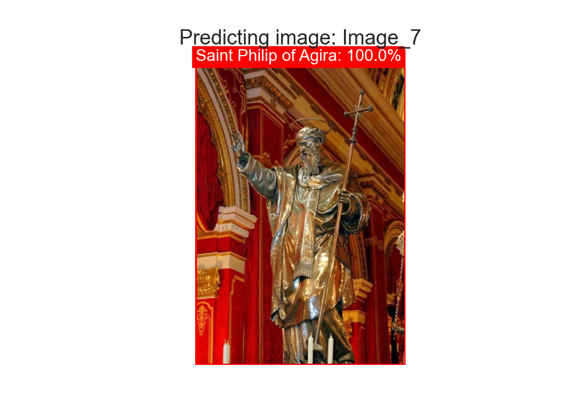
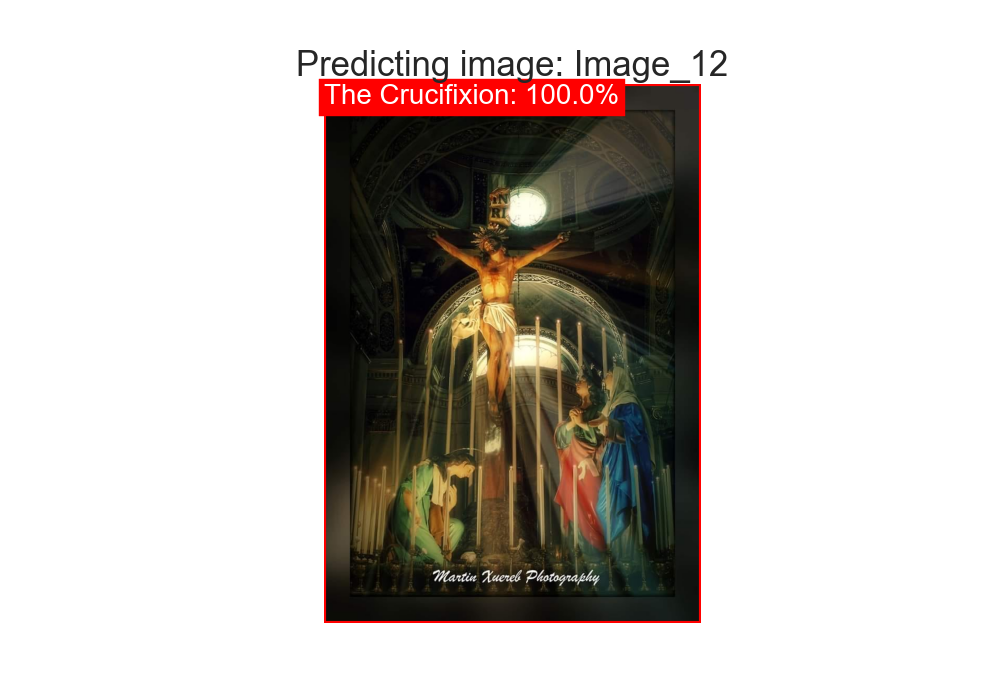
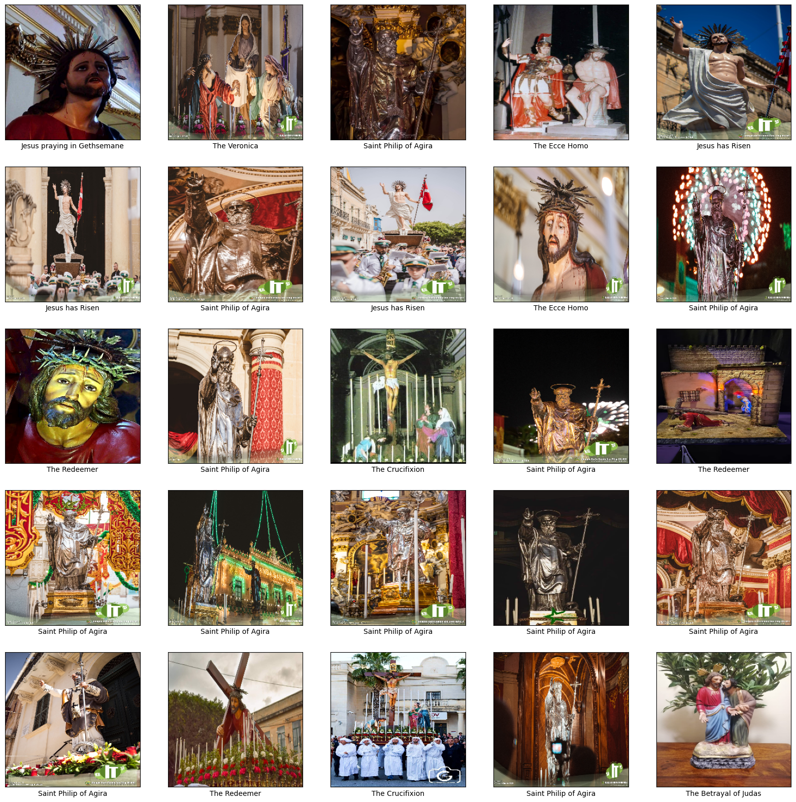
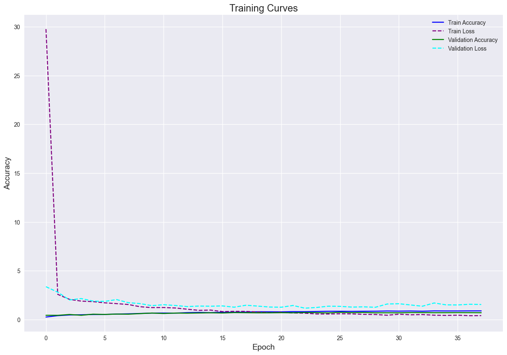
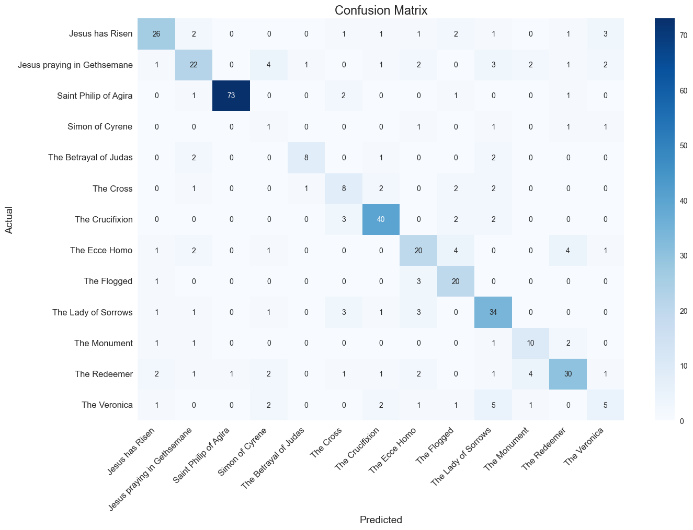
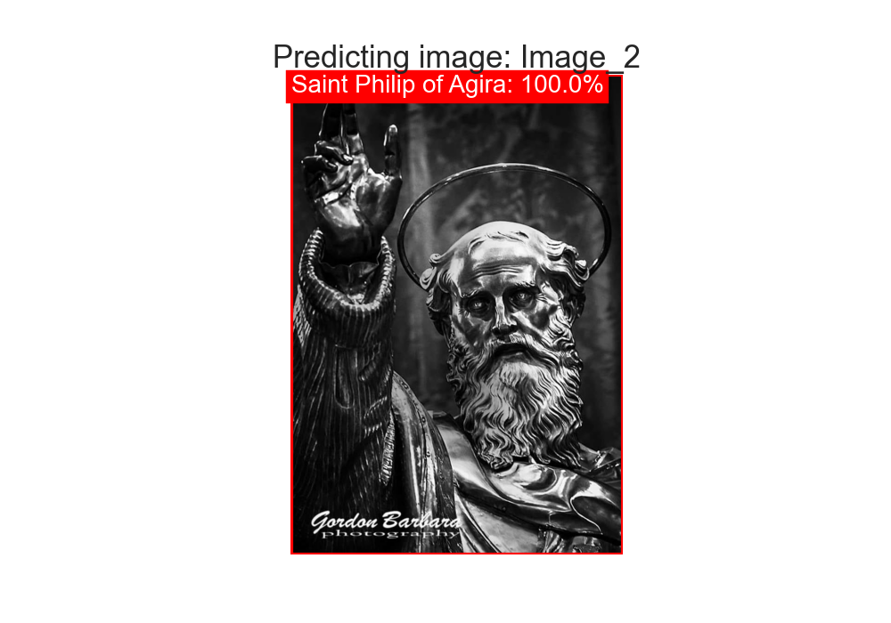
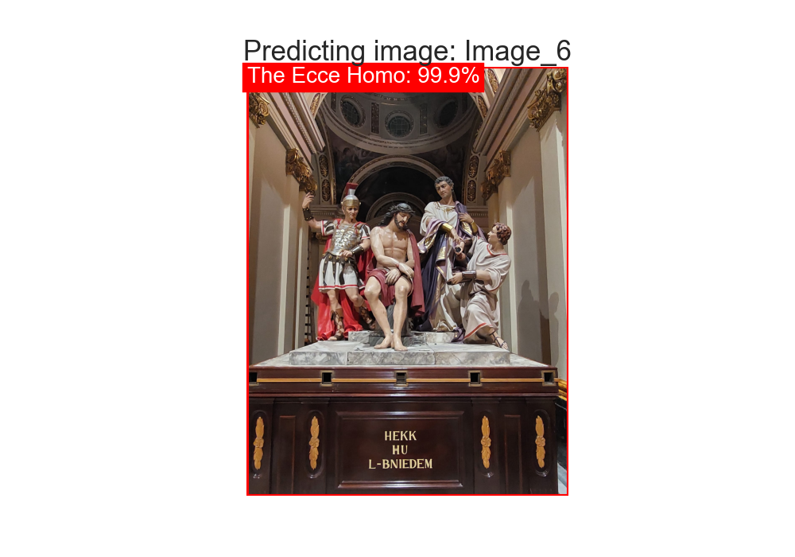
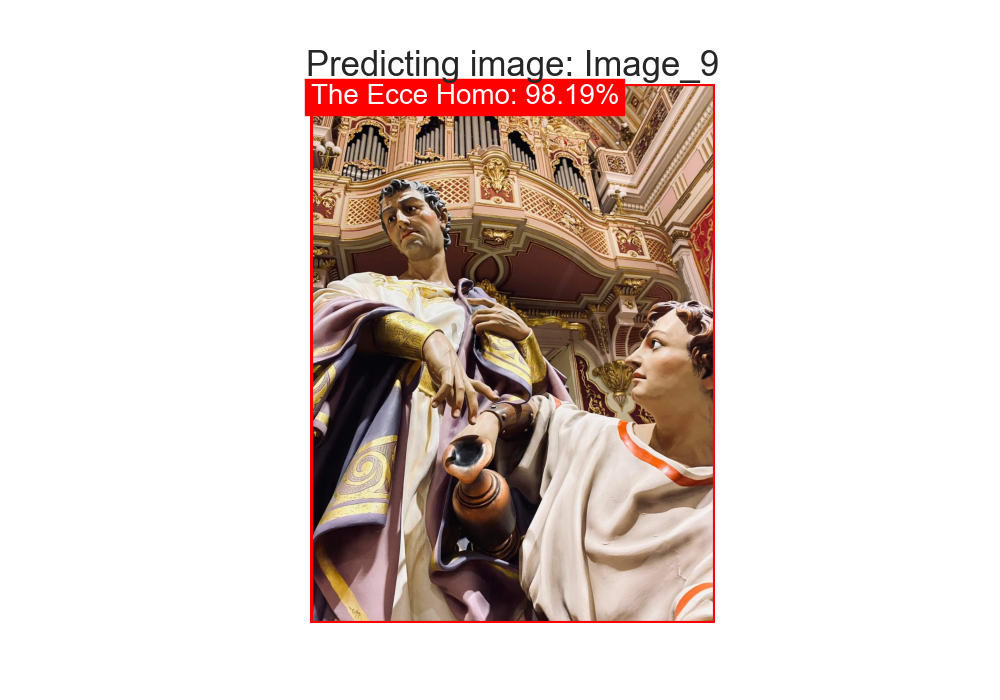
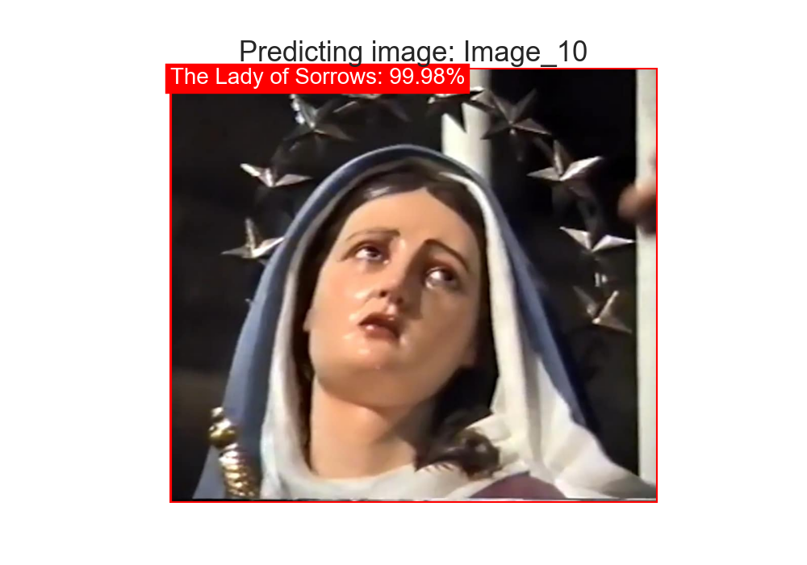

# Maltese Christian Statue (MCS) Classifier
 
<p align='center'>
<table align="center">
  <tr>
    <td align="center">
      
    </td>
    <td align="center">
      
  </tr>
</table>
</p>

## Introduction

<p align="justify">

The `Maltese Christian Statue (MCS) Classifier` project is not just a machine learning model; it embodies a deeper mission. Developed from the `MCS Dataset`, curated to represent 13 distinct categories of Maltese Christian statues, this project serves to preserve and celebrate Maltese religious culture. Its purpose extends beyond mere classification; it is a testament to the rich heritage of Malta, offering a glimpse into its religious traditions.

`Image classification` is a fundamental task in computer vision, involving the process of categorising images into predefined classes or categories. It leverages machine learning algorithms to analyse the visual content of images and assign them to appropriate labels based on their features and characteristics. In the context of the MCS Classifier project, image classification techniques are employed to automatically identify and categorise Maltese Christian statues depicted in images.

This initiative aims to safeguard and promote Maltese religious culture, especially during the solemn period of Lent. It serves as a bridge, introducing tourists to the intricacies of Maltese religious iconography, fostering understanding and appreciation.

Employing sophisticated image classification techniques, the project integrates artificial intelligence into the realm of Maltese Christianity, introducing AI where it's traditionally less explored. However, it's crucial to emphasise that this project isn't designed for mockery or disrespect towards religious beliefs. On the contrary, it adopts a solemn tone, seeking to uplift and deepen religious engagement.

Ultimately, the project aspires to contribute positively to the perpetuation and enrichment of Maltese religious heritage, potentially inspiring greater belief and dedication to its cause.

</p>

## MCS Dataset

<p align="justify">

The `MCS Dataset` features `13` categories of Christian statues found in Malta, specifically in the parish church of `Ħaż-Żebbuġ` dedicated to `St Philip of Agira`. Please note that the images retrieved for the creation of this dataset were extracted from public domain sources and are not intended for commercial use.

The categories in the MCS Dataset are:

1. `Jesus has Risen`
2. `Jesus praying in Gethsemane`
3. `Saint Philip of Agira`
4. `Simon of Cyrene`
5. `The Betrayal of Judas`
6. `The Cross`
7. `The Crucifixion`
8. `The Ecce Homo`
9. `The Flogged`
10. `The Lady of Sorrows`
11. `The Monument`
12. `The Redeemer`
13. `The Veronica`

</p>

<p align='center'>
  
</p>

## MCS Dataset Distribution

<p align="justify">

The `MCS Dataset` consists of `2432` images distributed across the `14` classes. Illustrated below is the distribution of the dataset across the classes. Additionally it is also important to note that the dataset is split into `80%` training and `20%` testing sets. Furthermore, `Data Augmentation` techniques were also used to increase the size of the dataset.

<p align='center'>
  
</p>

</p>

## MCS Classifier Model

<p align="justify">

Creating the MCS Classifier Model involved constructing a Convolutional Neural Network (CNN) using the `Keras` API. The model architecture incorporated the following layers:
- `VGG16 Base Model`: Utilising the VGG16 architecture with `imagenet` weights, excluding the final layer. The `MobileNetV2` model was also tried, but the VGG16 model performed better.
- `Flatten Layer`: Flattening the output from the VGG16 base model.
- `Dense Layer with 1024 units and ReLU Activation`: A densely connected layer with `1024` units and ReLU activation function. 
- `Dense Layer with 512 units and ReLU Activation`: A densely connected layer with `512` units and ReLU activation function.
- `Dense Layer with 13 units and Softmax Activation`: A densely connected layer with `13` units and softmax activation function, representing the output layer with `13` classes.

This configuration was chosen to facilitate efficient training by leveraging `transfer learning` techniques, utilising models pretrained on larger datasets. After model creation via the Keras API, training curves and a confusion matrix were generated to assess model performance, as depicted below.

`Training curves` offer a visual representation of the model's performance throughout the training process. These curves typically include plots of metrics such as loss and accuracy over epochs. Loss curves depict the model's error during training, showing how effectively the model is learning from the data. A decreasing loss indicates that the model is improving in its ability to make predictions. Accuracy curves illustrate the model's performance in terms of correctly classified samples over training epochs.

<p align='center'>
  
</p>

On the other hand, a `confusion matrix` provides insight into the model's classification performance by summarising the number of correct and incorrect predictions for each class. It displays a grid where rows represent the actual classes, while columns represent the predicted classes. Each cell in the matrix indicates the number of instances where a sample of a particular class was classified as another class. Confusion matrices enable a more detailed analysis of model performance, highlighting areas where the model struggles to distinguish between classes. Furthermore, a diagonal line of correctly classified samples on the matrix usually indicates a well-performing model.

<p align='center'>
  
</p>

Additionally, the model evaluation results indicate that the `MCS Classifier` achieved a `Test Accuracy` of `0.71`, meaning that approximately `71%` of the test images were correctly classified. The `Test Loss` of `1.16` represents the average loss over all test samples, with lower values indicating better performance. With a `Test Precision` of `0.73`, the model correctly identified about `73%` of the relevant images out of the total images it classified as relevant. The `Test Recall` of `0.71` signifies that the model successfully captured `71%` of all relevant images in the dataset. Lastly, the `Test F1 Score` of `0.72` provides a balance between precision and recall, offering a holistic measure of the model's performance, with higher values indicating better overall performance in image classification tasks. 

</p>

## MCS Classifier Predictions

<p align="justify">
Illustrated below are predictions made by the MCS Classifier Model on unseen images from the test dataset. The model demonstrates its ability to classify Maltese Christian statues accurately.


<p align='center'>
<table align="center">
  <tr>
    <td align="center">
      
    </td>
    <td align="center">
      
    </td>
    <td align="center">
      
    </td>
  </tr>
  <tr>
    <td align="center">
      
    </td>
    <td align="center">
      
    </td>
    <td align="center">
      
    </td>
  </tr>
  <tr>
    <td align="center">
      
    </td>
    <td align="center">
      
    </td>
    <td align="center">
      
    </td>
  </tr>
  <tr>
    <td align="center">
      
    </td>
    <td align="center">
      
    </td>
    <td align="center">
      
    </td>
  </tr>
  <tr>
    <td align="center">
      
    </td>
    <td align="center">
      
    </td>
    <td align="center">
      
    </td>
  </tr>
</table>
</p>

</p>

## Installation
To get started, clone the repository and navigate to it:
```bash
git clone https://github.com/mbar0075/Maltese-Christian-Statue-Classifier.git
cd Maltese-Christian-Statue-Classifier
```

You can also clone the environment used for this project using the `environment.yml` file provided in the `Requirements` directory. To do so, you will need to have Anaconda installed on your machine. If you don't have Anaconda installed, you can download it from [here](https://www.anaconda.com/products/distribution). Once you have Anaconda installed, you can run the following commands to install the environment and activate it

To install the environment, run the following command:
```bash
cd Requirements
conda env create -f environment.yml
conda activate MCS
```

Alternatively you can create the environment manually by running the following commands and install the packages in the `requirements.txt` file in the `Requirements` directory:
```bash
cd Requirements
conda create --name MCS python=3.9.16
conda activate MCS
pip install -r requirements.txt
```

In case you want to install the packages manually, you can do so by running the following commands:
<details>
<summary  style="color: lightblue; cursor: pointer"><i> pip install . . .</i></summary>

```bash
pip install notebook
pip install numpy
pip install matplotlib
pip install pandas
pip install seaborn
pip install opencv-python
pip install dm-tree
pip install scikit-learn

# Installing tensorflow with CUDA 11.2
conda install -c conda-forge cudatoolkit=11.2 cudnn=8.1.0
# Anything above 2.10 is not supported on the GPU on Windows Native
python -m pip install "tensorflow<2.11"
# Verify the installation:
python -c "import tensorflow as tf; print(tf.config.list_physical_devices('GPU'))"
```

In case of any further issues, you can install `cuda` from the following links: [NVIDIA CUDA Toolkit](https://developer.nvidia.com/cuda-toolkit-archive),
[Windows 11.8](https://developer.nvidia.com/cuda-11-8-0-download-archive?target_os=Windows&target_arch=x86_64&target_version=11&target_type=exe_local),
and install the corresponding `tensorflow` version from the following link: [TensorFlow](https://www.tensorflow.org/install/pip).
</details>

</p>