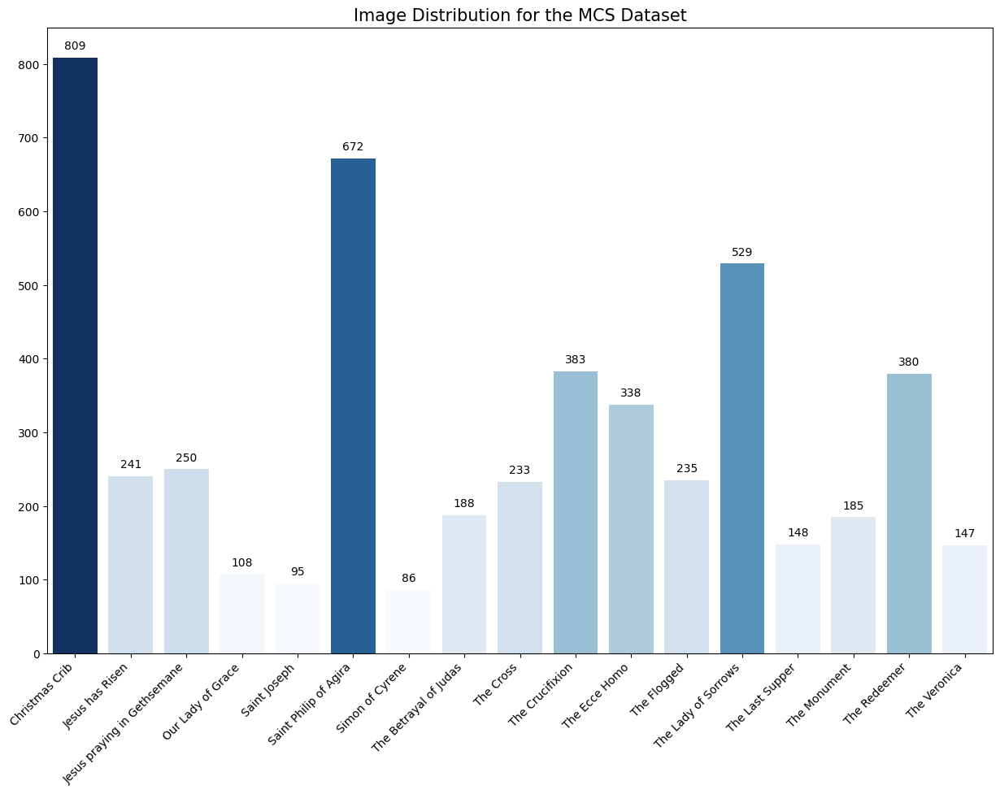

# Maltese Christian Statue (MCS) Classifier
 

<table align="center">
  <tr>
    <td align="center">
      
    </td>
    <td align="center">
      
  </tr>
</table>

## Introduction

The `Maltese Christian Statue (MCS) Classifier` project is not just a machine learning model; it embodies a deeper mission. Developed from the `MCS Dataset`, curated to represent 13 distinct categories of Maltese Christian statues, this project serves to preserve and celebrate Maltese religious culture. Its purpose extends beyond mere classification; it is a testament to the rich heritage of Malta, offering a glimpse into its religious traditions.

This initiative aims to safeguard and promote Maltese religious culture, especially during the solemn period of Lent. It serves as a bridge, introducing tourists to the intricacies of Maltese religious iconography, fostering understanding and appreciation.

Employing sophisticated image classification techniques, the project integrates artificial intelligence into the realm of Maltese Christianity, introducing AI where it's traditionally less explored. However, it's crucial to emphasise that this project isn't designed for mockery or disrespect towards religious beliefs. On the contrary, it adopts a solemn tone, seeking to uplift and deepen religious engagement.

Ultimately, the project aspires to contribute positively to the perpetuation and enrichment of Maltese religious heritage, potentially inspiring greater belief and dedication to its cause.

## MCS Dataset

The `MCS Dataset` features `13` categories of Christian statues found in Malta, specifically in the parish church of `Ħaż-Żebbuġ` dedicated to `St Philip of Agira`. Please note that the images retrieved for the creation of this dataset were extracted from public domain sources and are not intended for commercial use.

The categories in the MCS Dataset are:

1. `Jesus has Risen`
2. `Jesus praying in Gethsemane`
3. `Saint Philip of Agira`
4. `Simon of Cyrene`
5. `The Betrayal of Judas`
6. `The Cross`
7. `The Crucifixion`
8. `The Ecce Homo`
9. `The Flogged`
10. `The Lady of Sorrows`
11. `The Monument`
12. `The Redeemer`
13. `The Veronica`

  

## MCS Dataset Distribution

The `MCS Dataset` consists of `897` images distributed across the `13` classes. Illustrated below is the distribution of the dataset across the classes. Additionally it is also important to note that the dataset is split into `80%` training and `20%` testing data and utilise `Data Augmentation` techniques to increase the size of the dataset.

  

## MCS Classifier Model

Creating the MCS Classifier Model involved constructing a Convolutional Neural Network (CNN) using the `Keras` API. The model architecture incorporated the following layers:
- `VGG16 Base Model`: Utilising the VGG16 architecture with `imagenet` weights, excluding the final layer.
- `Flatten Layer`: Flattening the output from the VGG16 base model.
- `Dense Layer with 1024 units and Softmax Activation`: A densely connected layer with `1024` units and Softmax activation function. 

This configuration was chosen to facilitate efficient training by leveraging transfer learning techniques, utilising models pretrained on larger datasets. After model creation via the Keras API, training curves and a confusion matrix were generated to assess model performance, as depicted below.

`Training curves` offer a visual representation of the model's performance throughout the training process. These curves typically include plots of metrics such as loss and accuracy over epochs. Loss curves depict the model's error during training, showing how effectively the model is learning from the data. A decreasing loss indicates that the model is improving in its ability to make predictions. Accuracy curves illustrate the model's performance in terms of correctly classified samples over training epochs. By analysing training curves, researchers can identify trends, assess convergence, and determine whether further training is necessary.

  

On the other hand, a `confusion matrix` provides insight into the model's classification performance by summarising the number of correct and incorrect predictions for each class. It displays a grid where rows represent the actual classes, while columns represent the predicted classes. Each cell in the matrix indicates the number of instances where a sample of a particular class was classified as another class. Confusion matrices enable a more detailed analysis of model performance, highlighting areas where the model struggles to distinguish between classes. By examining the confusion matrix, researchers can identify specific classes that may require further attention or improvement in the model architecture or training data.

  

## MCS Classifier Predictions

Illustrated below are predictions made by the MCS Classifier Model on unseen images from the test dataset. The model demonstrates its ability to classify Maltese Christian statues accurately, showcasing its potential to identify and categorise religious iconography to preserve and celebrate Maltese religious culture.

<table align="center">
  <tr>
    <td align="center">
      
    </td>
    <td align="center">
      
    </td>
    <td align="center">
      
    </td>
  </tr>
  <tr>
    <td align="center">
      
    </td>
    <td align="center">
      
    </td>
    <td align="center">
      
    </td>
  </tr>
  <tr>
    <td align="center">
      
    </td>
    <td align="center">
      
    </td>
    <td align="center">
      
    </td>
  </tr>
  <tr>
    <td align="center">
      
    </td>
    <td align="center">
      
    </td>
    <td align="center">
      
    </td>
  </tr>
  <tr>
    <td align="center">
      
    </td>
    <td align="center">
      
    </td>
    <td align="center">
      
    </td>
  </tr>
</table>

